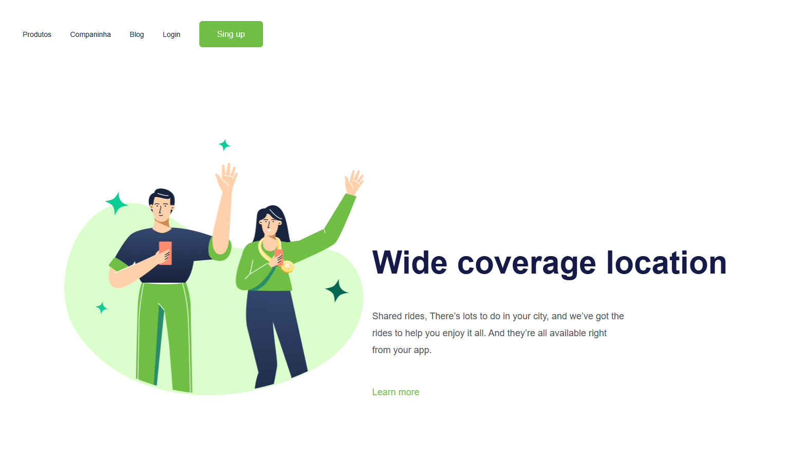

# CSS1 Challenge - My First Web Design Project 🎨💻

Welcome to my **CSS1 Challenge**! This is my first web design project, where I focused on building a simple and visually appealing website using **HTML** and **CSS**. It's part of my learning process to improve my front-end development skills and dive deep into the world of **CSS**.

## 🚀 **Project Overview**

This project is all about mastering **CSS** and using it to create an aesthetically pleasing webpage with a clean and structured design. I’ve applied custom styles, typography, and simple animations to make the website engaging for users.

### **Key Features**

- A modern, visually clean layout with custom **CSS** styles.
- Smooth typography and attention to detail in the design.
- **Hover effects** and **transitions** for a polished user experience.
- Simple, **static content** with no JavaScript used in this version.

### **Screenshots:**
 

## 🛠️ **Technologies Used**

- **HTML** - Structured the content and created the basic webpage.
- **CSS** - Styled the page with custom properties, colors, and layout designs.
- **Transitions & Hover Effects** - Enhanced the user experience with subtle animations.

## 🌱 **Future Improvements**

I plan to improve this project by:
- Adding **JavaScript** for interactive features.
- Experimenting with **CSS animations** to bring more life to the page.
- Enhancing the overall **design** with additional layouts and visual elements.

## 🔗 **Try it Yourself**

Check out the live demo of the project:  
[CSS1 Challenge Demo](https://lgabriel1912.github.io/Css1-desafio/)

## 📬 **Contact Me**

- Email: [lgabriel1912@gmail.com](mailto:yourname@domain.com)
- GitHub: [lgabriel1912](https://github.com/lgabriel1912)

Feel free to check out my other projects and provide feedback. I’m always open to learning and improving my skills! 😄
